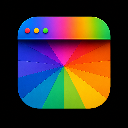

# HueBar

Automatically colorize VS Code title bars so each workspace is instantly recognizable — especially useful in **macOS Mission Control** where multiple VS Code windows appear side by side.

## Features

- **Auto-assign on open** — each workspace gets a unique color from the palette automatically, with no setup required
- **36 hand-picked colors** — named shades like Emerald, Cobalt, Wisteria, and Pomegranate that look great against the VS Code UI
- **Smart contrast** — foreground text color is computed automatically so your title bar remains readable
- **Inactive dimming** — the title bar subtly darkens when the window loses focus
- **Optional status bar coloring** — extend the workspace color to the status bar with one setting
- **Persistent** — colors survive restarts and are remembered per-workspace across sessions
- **Non-destructive** — only touches HueBar-owned color keys; any other `workbench.colorCustomizations` you've set are preserved

## Commands

| Command                         | Description                                             |
| ------------------------------- | ------------------------------------------------------- |
| `HueBar: Set Color`             | Pick a color from the palette for the current workspace |
| `HueBar: Reset Title Bar Color` | Remove the color and restore defaults                   |

Open the Command Palette (`⌘⇧P` / `Ctrl+Shift+P`) and type **HueBar** to find them.

## Settings

| Setting                 | Default       | Description                                                     |
| ----------------------- | ------------- | --------------------------------------------------------------- |
| `huebar.enabled`        | `true`        | Enable or disable title bar colorization                        |
| `huebar.scope`          | `"workspace"` | Write color to `workspace` settings or `user` (global) settings |
| `huebar.colorStatusBar` | `false`       | Also apply the workspace color to the status bar                |

## How it works

On startup, HueBar checks whether the current workspace already has a color assigned. If not, it automatically picks an unused color from the palette, stores it, and applies it. Colors are written to `workbench.colorCustomizations` in your workspace or user settings (depending on `huebar.scope`), so they work with any VS Code theme.

Use `HueBar: Set Color` at any time to manually override the auto-assigned color. Use `HueBar: Reset Title Bar Color` to clear it and let HueBar re-assign automatically.

## Requirements

VS Code 1.85 or later.

## License

MIT
